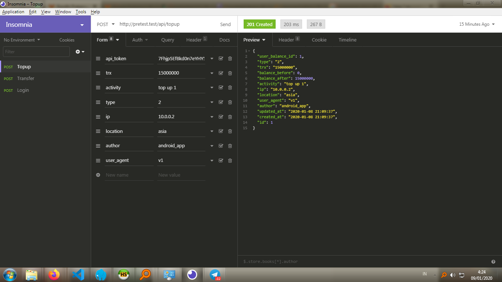
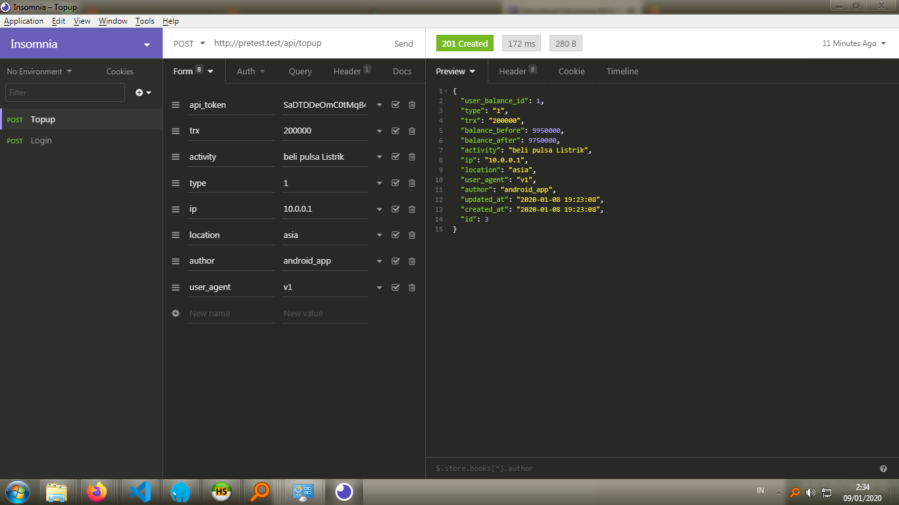
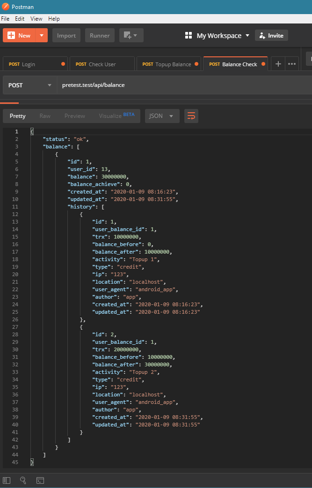

## Pretest BE mini E-Wallet
### Menggunakan Laravel 6

Cara Penggunaan
- Clone repo ini <code>git clone https://gitlab.com/randhi.pp/pretest.git</code>
- Jalankan composer install
- Sesuaikan database host, db_name, username, dan password di .env
- Create Key <code>php artisan key:generate</code>
- Migrate Database <code>php artisan migrate --seed</code>

Feature Status 
- Api Login : working <code>api/login</code>
- Api Logout : working <code>api/logout</code>
- Topup : working <code>api/topup</code>
- Payment/Pengurangan saldo : working <code>api/payment</code>
- Transfer antar User : working <code>api/transfer</code>
- Cek User Balance dengan history : Working <code>api/balance</code>

### Screenshoot

#### Topup

#### Payment

#### Transfer Balance to another user

#### Cek Saldo

